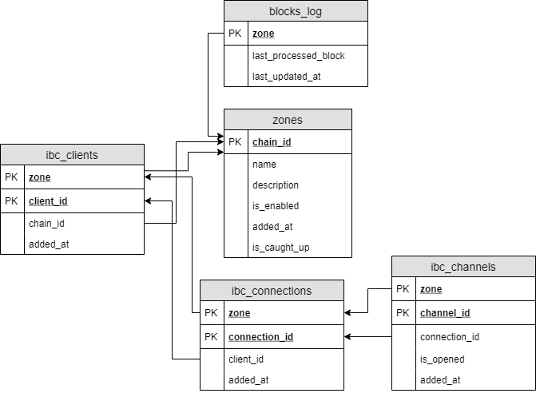

# HackAtom


`Starway Monster is a project that we created at the HackAtom hackathon.`
* [starway.monster](https://starway.monster) - a site that clearly shows how you can work with ibc.
* [github.com/starway-monster](https://github.com/starway-monster) - github project repository, which contains all the developments of this project.

## Content
* [Content](#Content)
* [Interface](#Interface)
* [Architecture](#Architecture)
* [Deployments](#Deployments)
* [Installation and Configuration](#Installation-and-Configuration)
* [Repositories](#Repositories)

## Interface

## Architecture

### Solution architecture

### Server architecture

Kubernetes cluster via argocd cluster architecture:


### Database
>*The database is the main part of the solution that stores the state of the solution. The database includes:*
>* *Core tables*
>* *Functions*

Database migrations work using the Hasura GraphQL migrations engine. The core tables store the state of the main solution logic and information about blockchains.



The functions are used to calculate statistics from **core tables**. The function is called by the front.

* **get_ibc_chain_graph_edges:**

    public.get_ibc_chain_graph_edges() RETURNS SETOF fn_table_ibc_chain_graph_edges

Details of the ```temp_t_total_stats``` temporary table are [here](database.md#temporary-tables).

### Message broker

>*The project uses the RabbitMQ message broker with one queue. All [watchers](watcher.md) write data to it, and the [processor/processors](processor.md) take data from the queue in portions.*

## Deployments

### Continuous Integration

>*Developers merge their changes back to the main branch as often as possible. The developer's changes are validated by creating a build and running automated tests against the build. By doing so, you avoid integration challenges that can happen when waiting for release day to merge changes into the release branch.*<br>
>*Continuous integration puts a great emphasis on testing automation to check that the application is not broken whenever new commits are integrated into the main branch.*


**Continuous integration has several main stages:**

* When changes are pushed to the master branch of the repositories at [github.com/starway-monster](https://github.com/starway-monster), **GitHub Actions** are triggered.
* **GitHub Actions** builds, tests, creates docker images and publishes them in our container registry on DigitalOcean - `registry.digitalocean.com/starway-monster`.
* After completing the job, **GitHub Actions** sends a notification to the telegram chat about the success or failure of the execution.

**GitHub Actions** workflow settings are described in each repository in the `.github/workflows` directory.

Each GitHub repository has secret keys for publishing images, for sending messages to telegrams, etc.

### Continuous Deployment

>*In our CI / cd process, we use argocd to manage the deployment*


Our continuous delivery uses **"argoCD"** and keeps track of the **"master"** directory in the **"deploy"** repository. The development application configuration for **"argoCD"** is located at **deploy/hackatom/app.yaml**. Any changes made to the **hackatom** directory of the deploy repository will be reflected on the development server.

## Installation and Configuration
`All components of our solution use Docker. By following the instructions in each individual repository, you can
quickly and easily deploy the work bench. We use our services in kubernetes, but you can do it directly without any problems.`

## Repositories

* [starway-monster/HackAtom](https://github.com/starway-monster/HackAtom) - starway monster project root documentation repository
* [starway-monster/front](https://github.com/starway-monster/front) - source code of a site written in angular. Displays route lookup data and allows users to perform interblockchain transactions
* [starway-monster/database](https://github.com/starway-monster/database) - source code of scripts for the database, code for configuring its deployment, migrations and graphql (hasura) api.
* [starway-monster/server](https://github.com/starway-monster/server) - source code of a site written in angular
* [starway-monster/deploy](https://github.com/starway-monster/deploy) - CI/CD setup code via argocd
* [starway-monster/cosmos-sdk](https://github.com/starway-monster/cosmos-sdk) - fork cosmos/cosmos-sdk that fixes FungibleTokenPacketData decoding error
* [starway-monster/cosmos-watcher](https://github.com/starway-monster/cosmos-watcher) - this is a fork of mapofzones/cosmos-watcher that has been modified for use in the starway monster. Allows you to connect to the blockchain fullnode and collect blockchain blocks
* [starway-monster/txs-processor](https://github.com/starway-monster/txs-processor) - this is a fork of mapofzones/txs-processor that has been modified for use in the starway monster. Allows you to process data received from watchers

